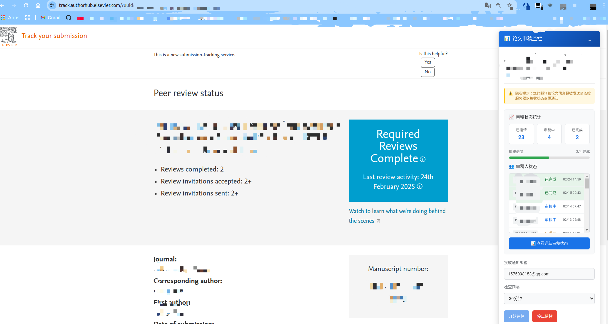
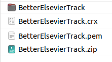
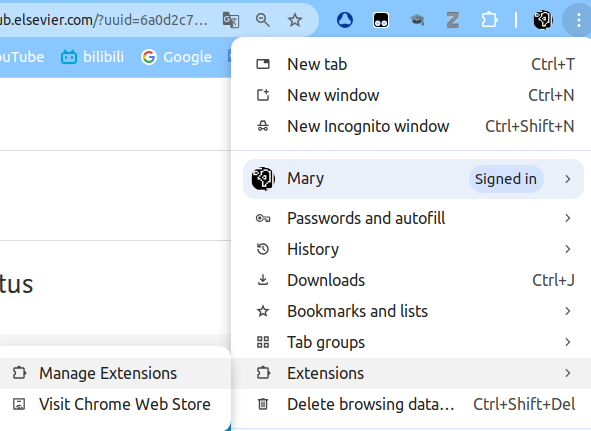
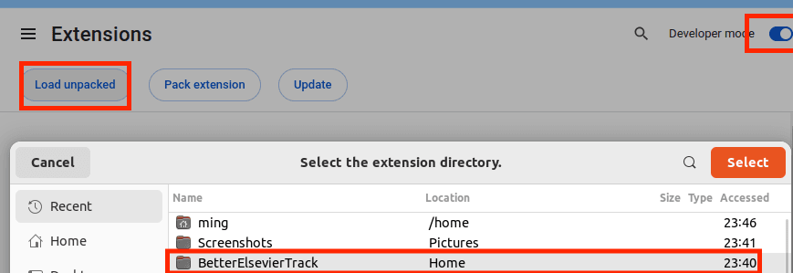
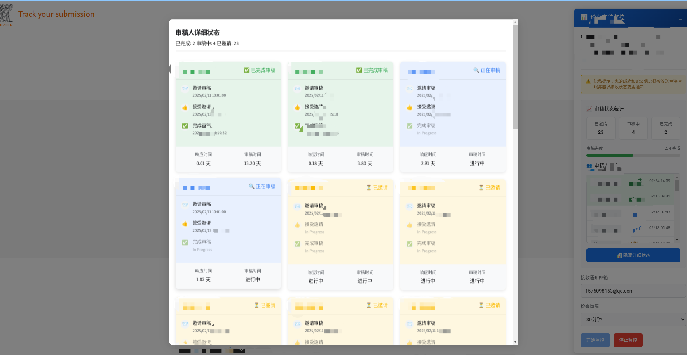

# Manuscript Review Tracking Extension
# 稿件审阅追踪扩展

## Overview 概述
A Chrome extension that helps track and visualize the manuscript review process in academic publishing platforms. It provides real-time monitoring and email notifications for status changes.
一个帮助追踪和可视化学术出版平台稿件审阅过程的 Chrome 扩展。提供实时监控和状态变更的邮件通知功能。

### 重要提示：获取最新稿件状态的方法
**本插件支持两种方式获取最新稿件状态：**

1. **通过通讯作者邮箱中的链接**：通讯作者邮箱中收到的链接可以获取到最新的稿件状态，但是，当审稿人数量大于2时，标准视图会显示受限。可以在Chrome中打开该链接，使用本插件。

2. **通过微信公众号**：虽然微信公众号上可以追踪稿件状态，但通常会延迟一天。使用时，在微信公众号的追踪稿件状态页面选择"用浏览器打开"，然后复制页面链接到Chrome浏览器中使用本插件。（目前已失效）

## Features 功能特性
- **Real-time tracking** of reviewer status and progress
- **实时追踪**审稿人状态和进度
- **Email notifications** when manuscript status changes
- **邮件通知**当稿件状态发生变化
- **Visual timeline** of review events with detailed reviewer cards
- **可视化时间线**展示审阅事件和详细的审稿人卡片
- **Statistical overview** of the review process
- **统计概览**审阅过程
- **Clean and intuitive interface** with minimizable panels
- **清晰直观的界面**，支持最小化面板

## Installation 安装方法
1. Download the extension files (ZIP)
   下载扩展文件（ZIP压缩包）
   

2. Extract the ZIP file
   解压ZIP文件

3. Open Chrome and go to `chrome://extensions/`
   打开 Chrome 浏览器，访问 `chrome://extensions/`
   

4. Enable "Developer mode" in the top-right corner
   在右上角启用"开发者模式"
   

5. Click "Load unpacked" and select the extracted extension directory
   点击"加载已解压的扩展程序"并选择已解压的扩展目录

## Usage 使用方法
After installation, the extension will automatically activate on supported manuscript management platforms including:
- Elsevier Author Hub
- Other academic publishing platforms with tracker APIs

The review tracking interface will appear at the top of the manuscript page.

安装后，扩展程序会在支持的稿件管理平台上自动激活，包括：
- Elsevier Author Hub
- 其他带有追踪器API的学术出版平台

审阅追踪界面将显示在稿件页面顶部。

### Main Interface 主界面
The main interface shows:
- Paper title and journal information
- Current review status statistics
- Email notification setup
- Monitoring controls

主界面显示：
- 论文标题和期刊信息
- 当前审稿状态统计
- 邮件通知设置
- 监控控制

### Detailed Reviewer Status 详细审稿人状态
Click "View Detailed Review Status" to see:
- Individual reviewer cards
- Timeline of review events
- Response and review times
- Status indicators

点击"查看详细审稿状态"可以看到：
- 单个审稿人卡片
- 审阅事件时间线
- 响应和审阅时间
- 状态指示器

## Supported Platforms 支持的平台
- Chrome浏览器

## Contributing 贡献指南
Contributions are welcome! Please feel free to submit a Pull Request.
欢迎贡献！请随时提交 Pull Request。

## License 许可证
MIT License
MIT 许可证
